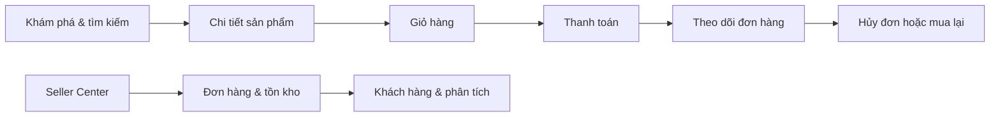

<div align="center">
  

  <h1>LOPA MARKET</h1>

  <p>
    Trải nghiệm thương mại điện tử hiện đại dành cho thị trường Việt Nam.<br />
    Từ khám phá sản phẩm đến thanh toán, theo dõi đơn hàng và vận hành gian hàng.
  </p>

  <p>
    <a href="https://nova-market-vn.longphan805.chatgpt.site"><strong>Live Demo</strong></a>
    ·
    <a href="#chạy-dự-án"><strong>Chạy cục bộ</strong></a>
    ·
    <a href="#tính-năng"><strong>Tính năng</strong></a>
  </p>

  <p>
    
    
    
    
    
  </p>
</div>

---

## Tổng quan

LOPA MARKET là một website bán hàng đa trang, tập trung vào trải nghiệm mua sắm liền mạch và giao diện tiếng Việt thân thiện trên cả máy tính lẫn thiết bị di động.

Dự án mô phỏng đầy đủ hành trình của khách hàng và người vận hành:



## Tính năng

### Dành cho khách hàng

| Nhóm | Khả năng |
| --- | --- |
| Khám phá | Tìm kiếm theo tên, lọc danh mục, giá, đánh giá và tốc độ giao hàng |
| Sản phẩm | Trang chi tiết, biến thể, đánh giá có kiểm duyệt, thông số và sản phẩm liên quan |
| So sánh | Đặt tối đa ba sản phẩm cạnh nhau theo giá, đánh giá, giao hàng và tồn kho |
| Cá nhân hóa | Ghi nhớ tối đa tám sản phẩm vừa xem trên thiết bị |
| Giỏ hàng | Lưu giỏ trên thiết bị, tách biến thể, kiểm tra tồn kho và áp dụng voucher đang hoạt động |
| Thanh toán | Chọn tỉnh/thành phố → phường/xã → địa chỉ chi tiết, ba tốc độ giao hàng và bốn phương thức thanh toán mô phỏng |
| Marketplace | Danh bạ gian hàng, trang riêng cho từng nhà bán hàng, phân bổ doanh thu, phí nền tảng và đối soát |
| Voucher nâng cao | Giảm cố định hoặc phần trăm, thời gian áp dụng, lượt dùng, giới hạn mỗi khách, ngân sách và phạm vi gian hàng |
| Tài khoản | Đăng ký, đăng nhập demo, hồ sơ, lịch sử mua hàng và tổng chi tiêu |
| Đơn hàng | Tiến trình xử lý, hóa đơn điện tử demo có VAT và thông tin doanh nghiệp, hủy và hoàn tồn kho, mua lại |
| Yêu thích | Lưu sản phẩm và thêm nhanh vào giỏ hàng |
| Hỗ trợ | Tra cứu mã đơn, FAQ, chính sách và biểu mẫu liên hệ an toàn |

### Dành cho quản trị viên

- Đăng nhập quản trị bằng mật khẩu được kiểm tra ở phía máy chủ.
- Phiên admin lưu trong cookie `HttpOnly`, `SameSite=Strict`.
- Dashboard doanh thu, đơn cần xử lý, khách hàng và đánh giá gian hàng.
- Tìm kiếm, lọc và cập nhật trạng thái đơn hàng.
- Thêm, sửa, xóa và khôi phục danh mục sản phẩm mẫu.
- Điều chỉnh tồn kho, ẩn/hiện sản phẩm và đồng bộ ngay ra toàn bộ gian hàng.
- Tạo, cập nhật, bật/tạm dừng và xóa voucher theo giá trị đơn tối thiểu.
- Duyệt, từ chối hoặc xóa đánh giá khách hàng trước khi công khai.
- Xuất danh sách đơn hàng đang lọc ra CSV.
- Phân tích giá trị đơn trung bình và tỷ lệ hoàn tất.
- Báo cáo doanh thu production từ D1 và phễu chuyển đổi thương mại điện tử.
- Seller Center theo từng gian hàng với ví doanh thu, phí hoa hồng và lịch sử đối soát.
- Quản lý thông tin doanh nghiệp, thuế suất và dữ liệu hiển thị trên hóa đơn.

### SEO và đo lường

- Sitemap, robots.txt, canonical URL, metadata Open Graph và dữ liệu có cấu trúc JSON-LD.
- Trang danh mục tối ưu tìm kiếm, trang gian hàng và Product/Offer schema cho từng sản phẩm.
- Google Analytics 4 được kích hoạt khi cấu hình `GOOGLE_ANALYTICS_ID`.
- Theo dõi các sự kiện chuẩn `view_item`, `add_to_cart`, `begin_checkout`, `purchase` và phễu chuyển đổi nội bộ.

### Trải nghiệm và an toàn

- Responsive cho desktop, tablet và mobile.
- Điều hướng mobile cố định, trạng thái rỗng và thông báo phản hồi rõ ràng.
- Không gửi hoặc lưu mật khẩu đăng nhập demo của khách hàng.
- Không thu thập dữ liệu thẻ hoặc thực hiện giao dịch tài chính thật.
- Chính sách vận chuyển, đổi trả, bảo mật và điều khoản được trình bày riêng.

## Các trang chính

| Đường dẫn | Nội dung |
| --- | --- |
| `/` | Trang chủ, tìm kiếm, bộ lọc và danh sách sản phẩm |
| `/product/:id` | Chi tiết sản phẩm và lựa chọn biến thể |
| `/category/:slug` | Trang danh mục tối ưu SEO |
| `/stores`, `/store/:slug` | Danh bạ và trang riêng của nhà bán hàng |
| `/cart` | Giỏ hàng và mã ưu đãi |
| `/checkout` | Giao hàng và thanh toán |
| `/orders/:id` | Chi tiết, tiến trình, hủy đơn và mua lại |
| `/invoices/:id` | Bản thể hiện hóa đơn điện tử, tải JSON và in/PDF |
| `/wishlist` | Danh sách yêu thích |
| `/compare` | Bảng so sánh tối đa ba sản phẩm |
| `/account` | Hồ sơ và lịch sử mua hàng |
| `/login`, `/register` | Đăng nhập và đăng ký demo |
| `/support` | Trung tâm trợ giúp và tra cứu đơn |
| `/policies/:slug` | Vận chuyển, đổi trả, bảo mật và điều khoản |
| `/admin` | LOPA Seller Center có mật khẩu bảo vệ |
| `/seller` | Vận hành gian hàng, phí nền tảng, ví và đối soát |

## Công nghệ

- **UI:** React 19, TypeScript, CSS thuần và React Server Components.
- **Framework:** Vinext — triển khai mô hình Next.js trên Cloudflare Workers.
- **Build:** Vite 8.
- **Runtime:** Node.js `>=22.13.0`.
- **Hosting:** OpenAI Sites / Cloudflare Workers.
- **Dữ liệu giao dịch mới:** Cloudflare D1 thông qua Drizzle migrations.
- **Dữ liệu dự phòng trên thiết bị:** `localStorage` và `sessionStorage`.
- **Đo lường:** Google Analytics 4 có thể cấu hình và kho sự kiện chuyển đổi nội bộ.

## Chạy dự án

### Yêu cầu

- Node.js `>=22.13.0`
- npm
- Git

### Cài đặt

```bash
git clone https://github.com/pnhl/banhang.git
cd banhang
npm install
```

Tạo tệp `.env.local` từ `.env.example`, sau đó thay giá trị mẫu bằng mật khẩu riêng:

```env
ADMIN_PASSWORD=your-strong-private-password
GOOGLE_ANALYTICS_ID=G-XXXXXXXXXX
```

Khởi động môi trường phát triển:

```bash
npm run dev
```

Mở [http://localhost:3000](http://localhost:3000).

> Không commit `.env.local` hoặc mật khẩu thật lên GitHub.

## Lệnh thường dùng

| Lệnh | Mục đích |
| --- | --- |
| `npm run dev` | Chạy môi trường phát triển |
| `npm run build` | Tạo bản build Cloudflare Workers |
| `npm start` | Chạy bản build sản xuất |
| `npm run lint` | Kiểm tra quy tắc mã nguồn |
| `npm test` | Build và kiểm tra các trang chính |
| `npm run db:generate` | Tạo migration Drizzle khi bổ sung schema |

## Cấu trúc dự án

```text
.
├── app/
│   ├── admin/              # Đăng nhập và Seller Center
│   ├── api/admin/          # API phiên quản trị
│   ├── account/            # Hồ sơ và lịch sử mua hàng
│   ├── cart/               # Giỏ hàng
│   ├── checkout/           # Luồng thanh toán
│   ├── components/         # Header và footer dùng chung
│   ├── lib/                # Danh mục, giỏ, tài khoản và đơn hàng
│   ├── orders/[id]/        # Theo dõi và thao tác đơn hàng
│   ├── policies/[slug]/    # Các trang chính sách
│   ├── product/[id]/       # Chi tiết sản phẩm
│   ├── support/            # Trung tâm trợ giúp
│   └── wishlist/           # Sản phẩm yêu thích
├── public/                 # Ảnh và tài nguyên tĩnh
├── tests/                  # Kiểm thử HTML các route chính
├── .openai/hosting.json    # Cấu hình dự án Sites
└── vite.config.ts          # Cấu hình Vinext/Vite
```

## Lưu trữ dữ liệu demo

Phiên bản hiện tại ưu tiên khả năng trình diễn độc lập, không cần tài khoản dịch vụ bên ngoài:

| Khóa | Dữ liệu |
| --- | --- |
| `nova-cart` | Giỏ hàng và biến thể |
| `nova-profile` | Hồ sơ khách hàng demo |
| `nova-orders` | Lịch sử và trạng thái đơn |
| `nova-wishlist` | Danh sách yêu thích |
| `nova-admin-products` | Danh mục do admin thêm hoặc chỉnh sửa |
| `nova-admin-stocks` | Tồn kho mô phỏng |
| `nova-admin-visibility` | Trạng thái hiển thị sản phẩm |
| `nova-vouchers` | Danh sách và trạng thái mã ưu đãi |
| `nova-reviews` | Đánh giá sản phẩm và trạng thái kiểm duyệt |
| `nova-recently-viewed` | Tối đa tám sản phẩm đã xem gần đây |
| `nova-compare` | Tối đa ba sản phẩm trong bảng so sánh |
| `nova-location-provinces-v2` | Bộ nhớ đệm tỉnh/thành phố theo địa giới hai cấp |
| `nova-location-wards-v2-*` | Bộ nhớ đệm phường/xã của từng tỉnh/thành phố |
| `nova-voucher-redemptions` | Lượt sử dụng và ngân sách voucher dự phòng trên thiết bị |
| `nova-analytics-events` | Tối đa 300 sự kiện chuyển đổi dự phòng trên thiết bị |
| `nova-business-profile` | Thông tin doanh nghiệp và thuế suất hiển thị trên hóa đơn |

Khi đặt hàng thành công, giao dịch, phân bổ nhà bán hàng, voucher, hóa đơn và sự kiện chuyển đổi được gửi tới D1 production; bản sao trên thiết bị vẫn được giữ để trải nghiệm không gián đoạn. Tồn kho trên trình duyệt hiện tại được trừ tự động.
Sản phẩm hết hàng không thể tăng số lượng hoặc tiếp tục thanh toán. Hủy đơn
đang chờ xác nhận sẽ hoàn lại số lượng vào kho.

Dữ liệu này chỉ tồn tại trên trình duyệt hiện tại và có thể mất khi người dùng xóa dữ liệu website.

## Đưa vào vận hành thực tế

Trước khi sử dụng cho cửa hàng thật, cần thay các luồng demo bằng dịch vụ sản xuất:

- Chuyển toàn bộ danh mục, khách hàng và tồn kho từ lớp dự phòng trình duyệt sang D1/PostgreSQL tập trung.
- Xác thực người dùng thực, phân quyền và khôi phục tài khoản.
- Tích hợp cổng thanh toán có webhook và xác minh chữ ký.
- Kết nối nhà cung cấp hóa đơn điện tử được cấp phép, chữ ký số và mã cơ quan thuế; bản JSON/PDF hiện tại chỉ là bản demo.
- Quản lý tồn kho tập trung và chống bán vượt số lượng.
- Email/SMS xác nhận, vận chuyển và chăm sóc khách hàng.
- Theo dõi lỗi, audit log, rate limiting và chống gian lận.
- Quản lý ảnh qua R2/CDN thay cho URL ảnh bên ngoài.

## Triển khai

Dự án đã được cấu hình cho OpenAI Sites thông qua `.openai/hosting.json` và tạo đầu ra Cloudflare Worker tương thích bằng:

```bash
npm run build
```

Trang demo hiện tại:

**https://nova-market-vn.longphan805.chatgpt.site**

> Trạng thái public phụ thuộc vào gateway của nền tảng hosting. Nếu URL báo thiếu quyền truy cập, hãy chạy dự án cục bộ hoặc triển khai cùng mã nguồn lên một tài khoản Cloudflare/Vercel do bạn quản lý.

## Kiểm thử

```bash
npm run lint
npm test
```

Bộ kiểm thử xác nhận trang chủ, các route thương mại chính và màn hình bảo vệ admin được render thành công.

## Đóng góp

1. Fork repository.
2. Tạo branch theo tính năng hoặc bản sửa lỗi.
3. Chạy `npm run lint` và `npm test`.
4. Gửi pull request kèm mô tả thay đổi và ảnh chụp nếu có cập nhật giao diện.

---

<div align="center">
  <strong>LOPA MARKET</strong><br />
  Chọn kỹ từng món. Giao nhanh từng đơn. Mua sắm nhẹ nhàng hơn mỗi ngày.
</div>
