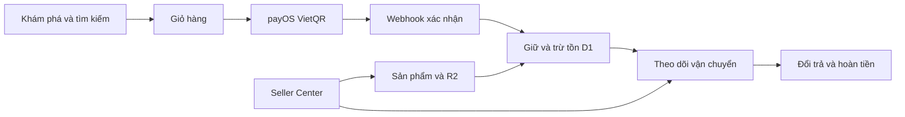

<div align="center">
  

  <h1>LOPA MARKET</h1>

  <p>
    Nền tảng thương mại điện tử đa gian hàng dành cho thị trường Việt Nam,<br />
    vận hành trên Cloudflare Workers với D1, R2 và thanh toán payOS.
  </p>

  <p>
    <a href="https://nova-market-vn.longphan805.chatgpt.site"><strong>Live Demo</strong></a>
    ·
    <a href="#khởi-chạy"><strong>Khởi chạy</strong></a>
    ·
    <a href="#kiến-trúc"><strong>Kiến trúc</strong></a>
  </p>

  <p>
    
    
    
    
    
  </p>
</div>

---

## Tổng quan

LOPA MARKET kết nối trọn vẹn hành trình khách hàng, người bán và quản trị viên:



## Tính năng

### Khách hàng

- Tìm kiếm có xếp hạng độ phù hợp, lọc giá, đánh giá và thời gian giao.
- Chi tiết sản phẩm, biến thể, tồn kho, so sánh, yêu thích và đánh giá.
- Giỏ hàng responsive với voucher và kiểm tra số lượng có thể bán.
- Địa chỉ theo mô hình tỉnh/thành phố → phường/xã → địa chỉ chi tiết.
- Thanh toán payOS bằng mã VietQR đúng tổng tiền của giỏ hàng.
- Tự động cập nhật thanh toán qua webhook có xác minh HMAC-SHA256.
- Đồng bộ hồ sơ, đơn hàng và thông báo từ D1 trên nhiều thiết bị.
- Theo dõi vận chuyển bằng mã tracking và dòng thời gian sự kiện.
- Gửi, theo dõi yêu cầu đổi trả và trạng thái hoàn tiền ngay trên đơn.

### Người bán

- Hồ sơ đăng ký gian hàng và quy trình xét duyệt có nhật ký.
- Vai trò `seller` được kiểm tra phía máy chủ ở mọi API quan trọng.
- Tạo sản phẩm, cập nhật tồn có thể bán và ngưỡng cảnh báo sắp hết.
- Tồn kho tách riêng `available`, `reserved` và `sold`.
- Thư viện ảnh R2: tải lên, xem, sao chép URL và xóa theo quyền sở hữu.
- Cập nhật hãng vận chuyển, mã tracking, trạng thái và ghi chú cho khách.
- Xử lý đổi trả, phương án giải quyết và số tiền hoàn.
- Báo cáo doanh thu, phí nền tảng, số dư và lịch sử đối soát.

### Quản trị

- Phân quyền `customer`, `seller`, `admin` trong D1.
- Đăng nhập bằng danh tính nền tảng; website không lưu mật khẩu người dùng.
- Danh sách email quản trị được cấu hình qua `ADMIN_EMAILS`.
- Mật khẩu admin cũ chỉ còn là cơ chế khẩn cấp tương thích ngược.
- Duyệt hoặc từ chối hồ sơ người bán và tự động cấp vai trò.
- Quản trị tồn kho, vận chuyển, đổi trả, ảnh và báo cáo từ một hệ thống.
- Rate limiting cho các thao tác nhạy cảm và audit log không phụ thuộc client.
- Security headers mặc định trên Cloudflare Worker.

## Thanh toán payOS

Luồng thanh toán không tin dữ liệu giá từ trình duyệt:

1. Máy chủ đọc lại sản phẩm và giá từ D1.
2. Kiểm tra số lượng, voucher và phí giao hàng.
3. Giữ tồn bằng giao dịch D1 trước khi gọi payOS.
4. Tạo mã VietQR và link thanh toán có thời hạn 15 phút.
5. Xác minh chữ ký webhook trước khi xác nhận đơn.
6. Khi thành công: chuyển `reserved → sold`.
7. Khi hủy, lỗi hoặc hết hạn: chuyển `reserved → available`.

Webhook mặc định:

```text
/api/payments/payos/webhook
```

Hệ thống tự gọi API xác nhận webhook ở giao dịch đầu tiên. Có thể ghi đè URL
bằng `PAYOS_WEBHOOK_URL`.

## Kiến trúc

| Lớp | Công nghệ | Vai trò |
| --- | --- | --- |
| Giao diện | React 19, Vinext, CSS responsive | Storefront, tài khoản, checkout và Seller Center |
| Runtime | Cloudflare Workers | SSR, API và security headers |
| Dữ liệu | Cloudflare D1, Drizzle migrations | Tài khoản, vai trò, sản phẩm, tồn, đơn, thanh toán, vận chuyển |
| Tệp | Cloudflare R2 | Ảnh sản phẩm và bằng chứng đổi trả |
| Thanh toán | payOS API + VietQR + webhook | Tạo QR, xác nhận tự động và đồng bộ trạng thái |
| Xác thực | Sign in with ChatGPT | Danh tính thật do nền tảng quản lý phiên |

Các bảng D1 chính:

```text
app_users            platform_products     inventory
commerce_orders      order_items           payment_intents
shipments            shipping_events       return_requests
media_assets         notifications         seller_applications
audit_logs           rate_limits           seller_ledger
```

## Các route chính

| Route | Nội dung |
| --- | --- |
| `/` | Trang chủ và danh mục sản phẩm D1 |
| `/search` | Tìm kiếm và gợi ý sản phẩm |
| `/product/:id` | Chi tiết sản phẩm |
| `/cart`, `/checkout` | Giỏ hàng và payOS VietQR |
| `/account` | Hồ sơ và lịch sử đơn đồng bộ |
| `/notifications` | Thanh toán, vận chuyển, đổi trả và quyền |
| `/orders/:id` | Chi tiết, tracking và yêu cầu đổi trả |
| `/stores`, `/store/:slug` | Marketplace đa gian hàng |
| `/seller/onboarding` | Đăng ký mở gian hàng |
| `/seller` | Báo cáo và đối soát |
| `/seller/operations` | Sản phẩm, tồn kho, vận chuyển và đổi trả |
| `/seller/media` | Quản lý ảnh trong R2 |
| `/admin` | Quản trị hệ thống |
| `/policies/:slug` | Vận chuyển, đổi trả, bảo mật và điều khoản |

## Khởi chạy

Yêu cầu:

- Node.js `>=22.13.0`
- npm

```bash
git clone https://github.com/pnhl/banhang.git
cd banhang
npm install
```

Tạo `.env.local` từ `.env.example`:

```env
ADMIN_EMAILS=admin@example.com
ADMIN_PASSWORD=strong-emergency-password

PAYOS_CLIENT_ID=
PAYOS_API_KEY=
PAYOS_CHECKSUM_KEY=
PAYOS_WEBHOOK_URL=

GOOGLE_ANALYTICS_ID=
```

Không commit khóa payOS hoặc mật khẩu vào Git.

Khởi động:

```bash
npm run dev
```

Mở [http://localhost:3000](http://localhost:3000).

## Cơ sở dữ liệu

Schema nằm tại `db/schema.ts`; migration nằm trong `drizzle/`.

```bash
npm run db:generate
```

`ensureProductCatalog()` tự đưa 10 sản phẩm mặc định vào D1 trong lần truy cập
đầu tiên. Các sản phẩm do seller tạo sau đó trở thành dữ liệu tập trung.

R2 dùng logical binding:

```json
{
  "d1": "DB",
  "r2": "MEDIA"
}
```

## Kiểm thử

```bash
npm run lint
npx tsc --noEmit
npm test
```

`npm test` tạo bản build production và kiểm tra HTML của các route thương mại
chính.

## Triển khai

Dự án đã gắn với OpenAI Sites qua `.openai/hosting.json`.

```bash
npm run build
```

Live deployment:

**https://nova-market-vn.longphan805.chatgpt.site**

Để payOS hoạt động thật, ba khóa của kênh thanh toán phải được thêm vào biến
môi trường của deployment. Nếu chưa có khóa, website trả thông báo cấu hình rõ
ràng và không tạo một giao dịch giả.

## Trạng thái dữ liệu trình duyệt

Giỏ hàng, yêu thích, so sánh và một bản sao đơn gần đây vẫn dùng `localStorage`
để thao tác nhanh. D1 mới là nguồn dữ liệu có thẩm quyền cho:

- tài khoản và vai trò;
- danh mục và tồn kho;
- đơn payOS và trạng thái thanh toán;
- tracking, đổi trả, thông báo và audit log;
- metadata ảnh R2.

---

<div align="center">
  <strong>LOPA MARKET</strong><br />
  Chọn kỹ từng món. Giao nhanh từng đơn. Vận hành bằng dữ liệu thật.
</div>
